<h1 align="center">
  <br>
  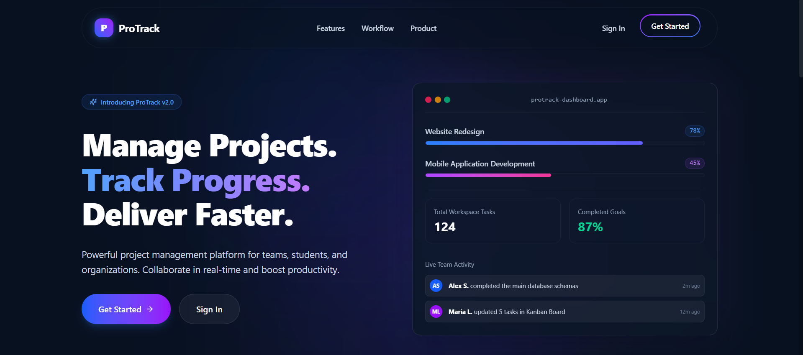<br>
  ProTrack
</h1>

<p align="center">
  <strong>A premium enterprise-grade project management platform built on the MERN stack.</strong>
</p>

<p align="center">
  
  
  
  
  
  
  
</p>

---

## Key Features

*   **Secure Authentication:** JWT-based user authentication and token rotation.
*   **Role-Based Access Control (RBAC):** Distinct dashboards, privileges, and workflows for **Admins** and **Employees**.
*   **Robust Project Management:** Create, update, view, and organize projects with status tracking, deadlines, and owners.
*   **Granular Task Management:** Task creation, assignments, priority settings, and due dates.
*   **Kanban Board:** Fully interactive drag-and-drop Kanban interface for seamless workflow progression.
*   **Team Collaboration:** Live discussions, comment feeds, and immediate feedback loops on tasks.
*   **Rich Analytics Dashboard:** Comprehensive analytics widgets, metrics, charts, and progress overview statistics.
*   **File Attachments:** Upload and manage documents, assets, and design files directly within tasks.
*   **Real-Time Notifications:** Dynamic alerts and notifications keeping team members updated.
*   **Dark Theme UI:** Premium, modern, high-contrast dark theme designed to match premium SaaS tools.
*   **Fully Responsive Design:** Fluid, adaptive layout optimized across desktop, tablet, and mobile screens.

---

## Tech Stack

| Frontend | Backend | Database | Auth & Utilities | Tools |
| :--- | :--- | :--- | :--- | :--- |
| **React** (v18+) | **Node.js** | **MongoDB** | **JWT Authentication** | **Vite** |
| **TypeScript** | **Express** | **Mongoose ODM** | **bcryptjs** | **npm / Node Package Manager** |
| **Tailwind CSS** | **Socket.io** (Realtime) | **MongoDB Atlas** | **nodemailer** (Email notification) | **Git / GitHub** |

---

## Screenshots

<details>
<summary> Click to view Public & Landing Page Screenshots</summary>

### Landing Page


### Features
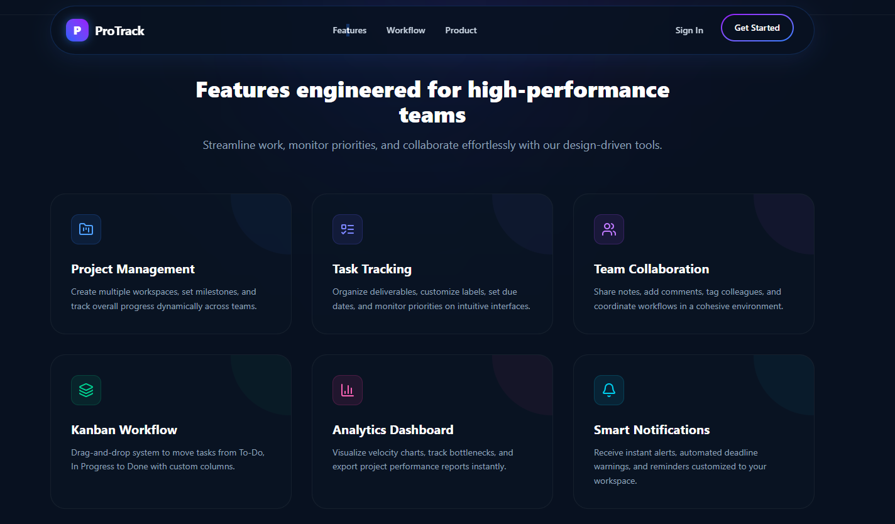

### Dashboard Preview
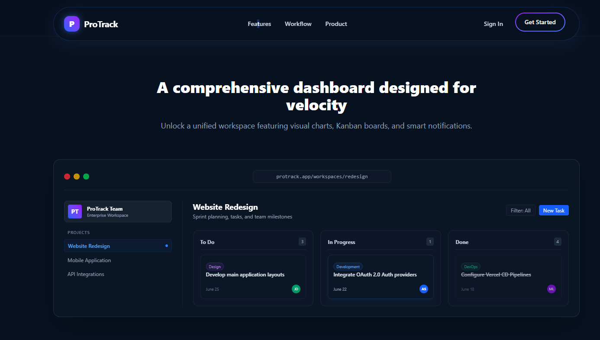

### Workflow
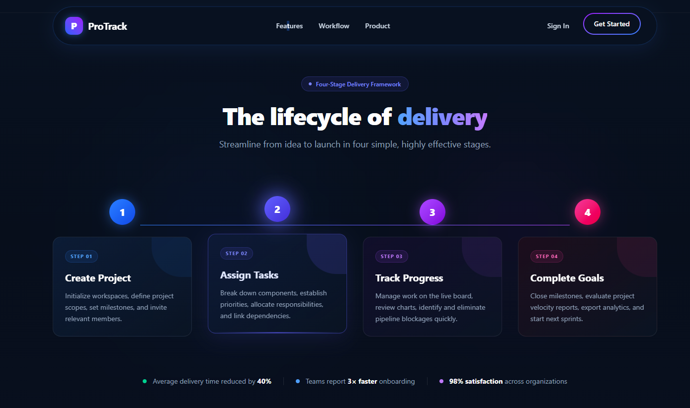

### Login
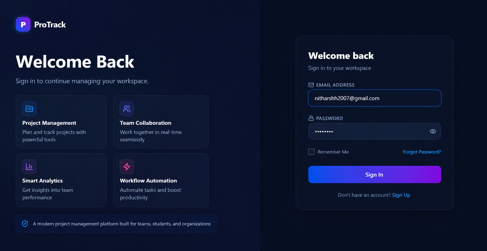

</details>

<details>
<summary>Click to view Admin Portal Screenshots</summary>

### Dashboard
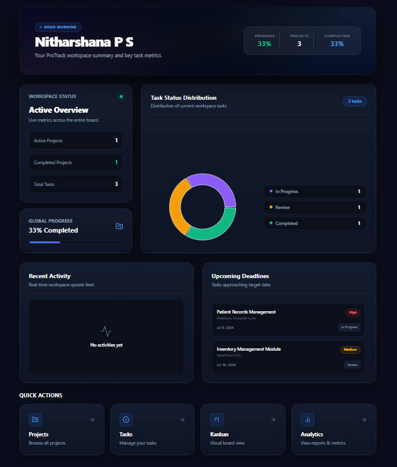

### Projects
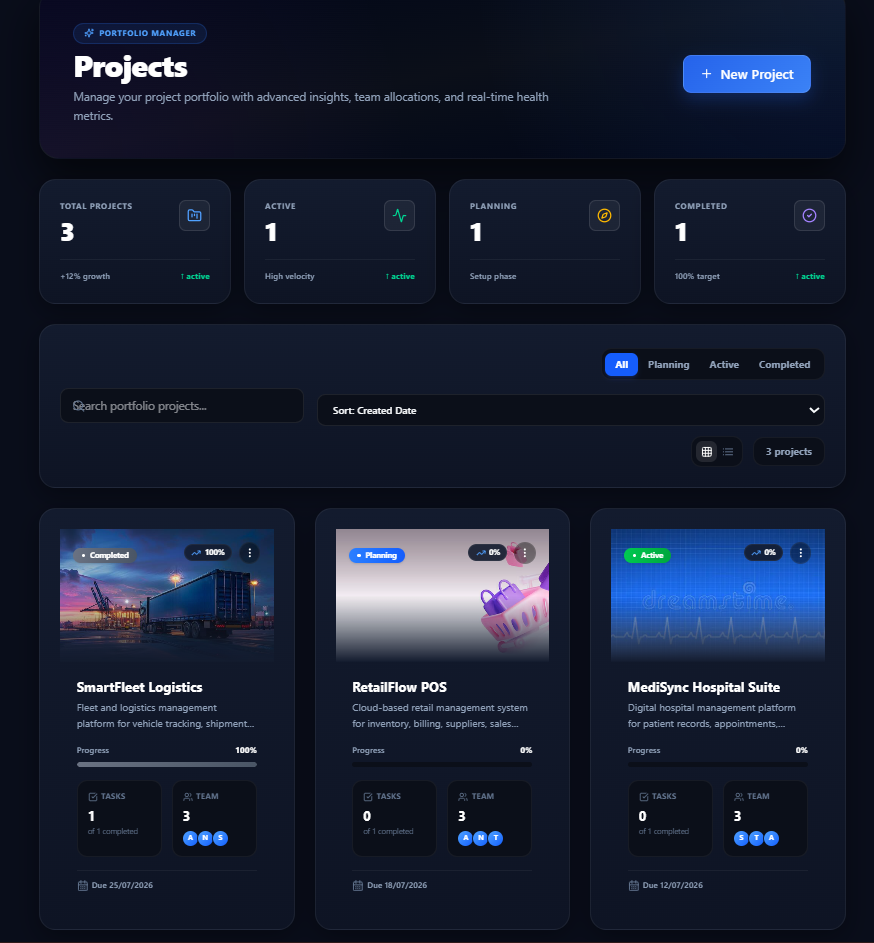

### Kanban Board
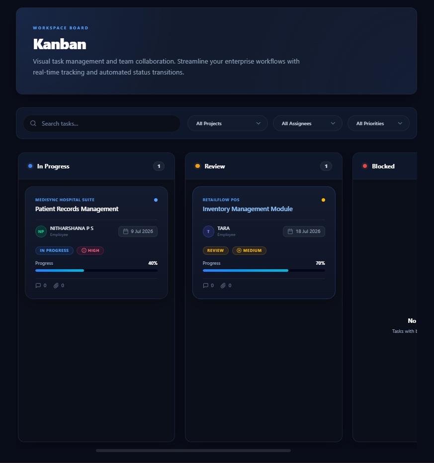

### Analytics Overview


### Analytics Charts


### Team Management
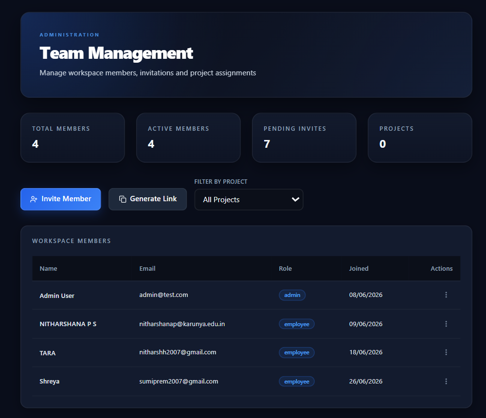

</details>

<details>
<summary>Click to view Employee Portal Screenshots</summary>

### Dashboard
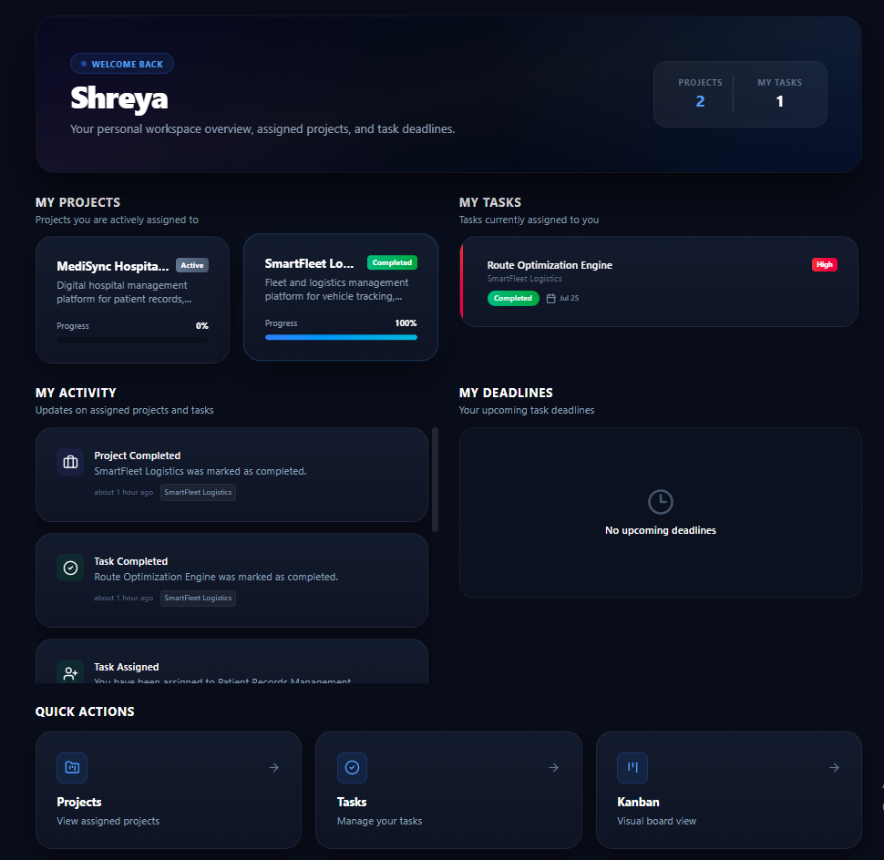

### Projects
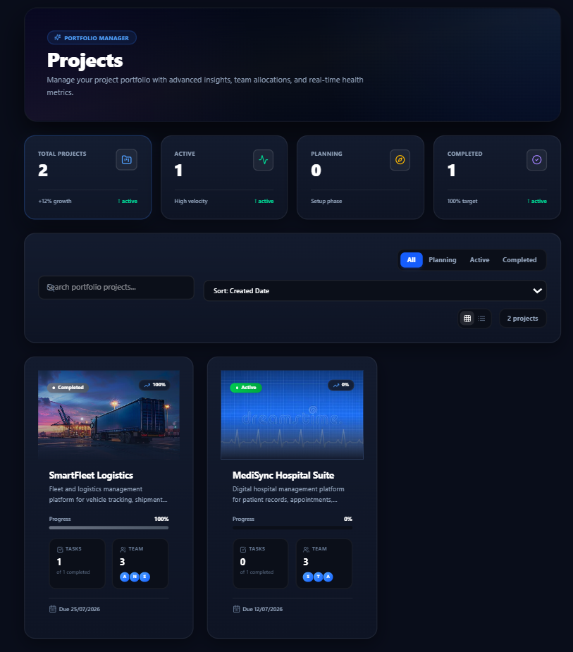

### Tasks
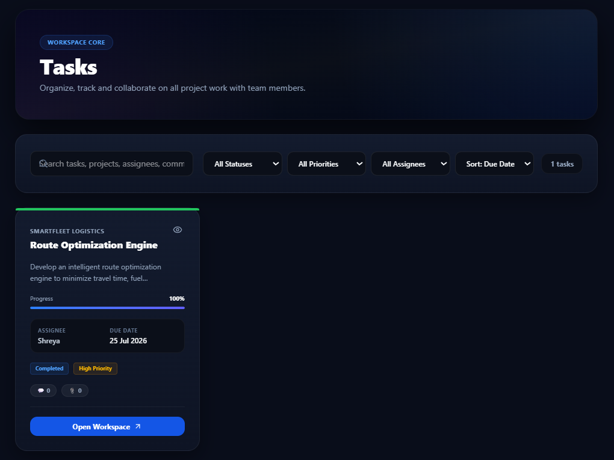

### Analytics
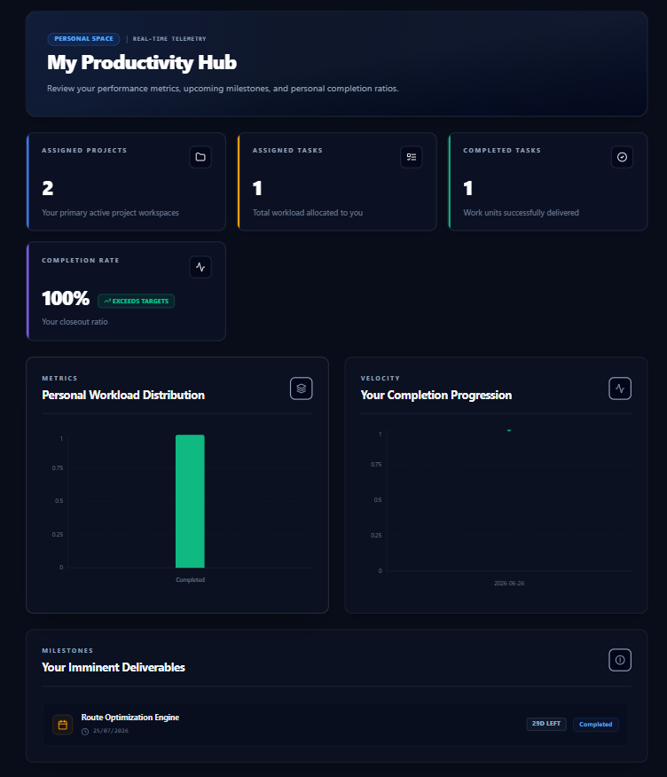

### Comments
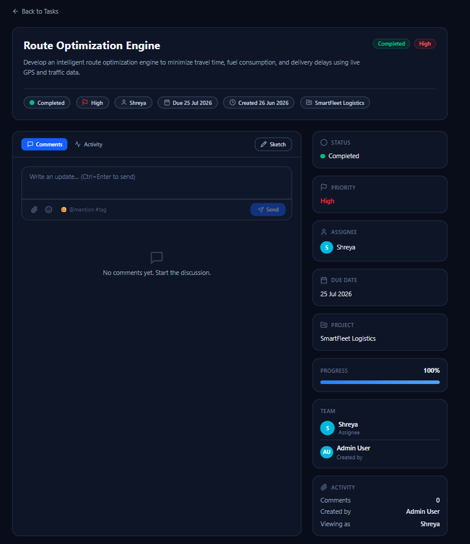

</details>

---

## Project Structure

```text
ProTrack/
├── client/                 # Frontend React SPA
│   ├── public/             # Static public assets
│   ├── src/                # React source code
│   │   ├── assets/         # Images, fonts, and global icons
│   │   ├── components/     # Reusable UI components
│   │   ├── lib/            # Third-party config & clients (Axios, etc.)
│   │   ├── pages/          # App views & dashboard pages
│   │   ├── routes/         # Router declarations & route guards
│   │   ├── services/       # API integration layer
│   │   ├── store/          # Global state management
│   │   ├── types/          # TypeScript interface definitions
│   │   ├── App.tsx         # Root app layout & routes
│   │   ├── index.css       # Core design utility rules & Tailwind directives
│   │   └── main.tsx        # Application entrypoint
│   ├── package.json
│   └── tsconfig.json
├── server/                 # Backend Node/Express API
│   ├── src/                # Express source code
│   │   ├── config/         # Database and server config
│   │   ├── controllers/    # Route handler controllers
│   │   ├── middleware/     # Auth, error, and role validation middleware
│   │   ├── migrations/     # Seeders and migration scripts
│   │   ├── models/         # MongoDB schemas & Mongoose models
│   │   ├── realtime/       # WebSockets / Socket.io implementations
│   │   ├── routes/         # API Endpoint routing definitions
│   │   ├── services/       # Email & helper business logic services
│   │   ├── types/          # Shared server-side TypeScript models
│   │   └── server.ts       # Main server starter entrypoint
│   ├── package.json
│   └── tsconfig.json
└── docs/                   # UI/UX Mockups & screenshots repository
```

---

## Installation

Follow these steps to set up the project locally on your machine.

### 1. Clone the repository
```bash
git clone https://github.com/nitharshh2007-creator/ProTrack.git
cd ProTrack
```

### 2. Configure Environment Variables
Create a `.env` file in both `client/` and `server/` folders based on the configurations shown below.

### 3. Install & Start Backend Server
```bash
cd server
npm install
npm run dev
```

### 4. Install & Start Frontend Client
In a new terminal window:
```bash
cd client
npm install
npm run dev
```

---

## Environment Variables

The backend application requires the following environment variables to run successfully:

Create a `.env` file inside the `server` directory and add the following:

```env
PORT=5000
MONGO_URI=mongodb://localhost:27017/protrack
JWT_SECRET=your_jwt_secret_token_here
EMAIL_USER=your-email@gmail.com
EMAIL_PASS=your-email-app-password
CLIENT_URL=http://localhost:5173
```

---

## Future Improvements

- [ ] **Real-time Chat:** Direct messaging and group channels for instant team collaboration.
- [ ] **Gantt Charts:** Visual timeline planning for project phases and milestones.
- [ ] **Integrations:** Integration with popular platforms like Slack, GitHub, and Jira.
- [ ] **Time Tracking:** Built-in timer to record hours spent on individual tasks.
- [ ] **AI Assistant:** Automated task estimation, summaries, and sprint optimization insights.

---

## License

Distributed under the MIT License. See `LICENSE` for more details.

---

## Author

*   **Nitharshh** - [GitHub Profile](https://github.com/nitharshh2007-creator)

---

<p align="center">
  If you found this project useful, consider starring the repository! ⭐
</p>
